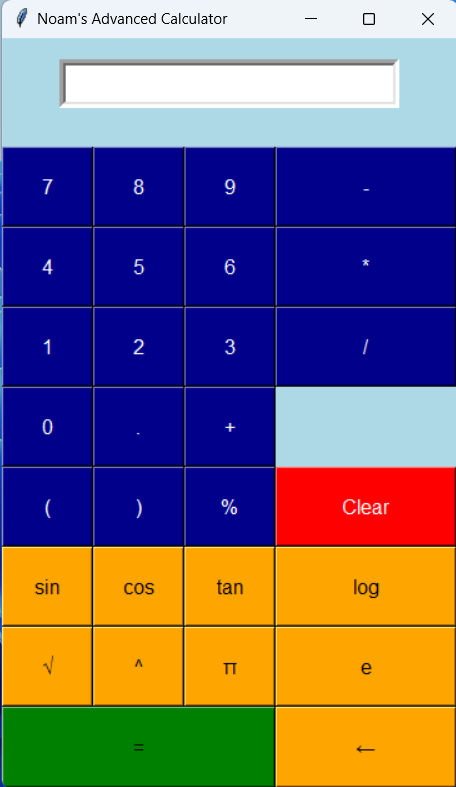

# Python-GUI-Calculator
A simple GUI Calculator using Tkinter in Python.

    

## How it works?

This calculator has an entry box that can accept input from the keyboard. Additionally, it also has buttons which, when pressed, automatically insert the corresponding character in the entry box. After that, when the equal button is clicked, it takes the input from the entry box, evaluates the result, and displays it in the entry box.
